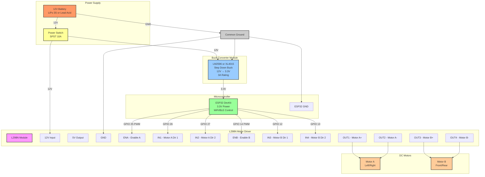

# RC Car Circuit Diagram
## https://www.instagram.com/reel/DP4XxTVE8pj/?igsh=dnBqNXNpYWpiYTY2

## Circuit Diagram

## Components List

- 12V Battery (LiPo 3S or Lead Acid)
- Power Switch (SPST, 10A)
- Buck Converter (LM2596/XL4015, 12V→3.3V, 3A)
- ESP32 DevKit
- L298N Motor Driver Module
- 2x DC Motors (6-12V)
- Wires & Connectors

## Wiring Connections

### Power System
- **Battery (+)** → **Power Switch** → **Buck Converter IN** & **L298N 12V**
- **Battery (-)** → **Common Ground**
- **Buck Converter OUT (3.3V)** → **ESP32 3.3V Pin**

### ESP32 → L298N Control Pins
| ESP32 GPIO | L298N Pin | Function |
|------------|-----------|----------|
| GPIO 25    | ENA       | Motor A Speed (PWM) |
| GPIO 26    | IN1       | Motor A Direction 1 |
| GPIO 27    | IN2       | Motor A Direction 2 |
| GPIO 14    | ENB       | Motor B Speed (PWM) |
| GPIO 12    | IN3       | Motor B Direction 1 |
| GPIO 13    | IN4       | Motor B Direction 2 |

### L298N → Motors
- **OUT1 & OUT2** → Motor A
- **OUT3 & OUT4** → Motor B

### Ground Connections
Connect all grounds together:
- Battery (-)
- Buck Converter GND
- ESP32 GND
- L298N GND

## Setup Instructions

1. **Adjust Buck Converter First:**
   - Connect 12V input to buck converter
   - Measure output voltage with multimeter
   - Adjust potentiometer to exactly **3.3V**
   - ⚠️ Never exceed 3.6V or ESP32 will be damaged

2. **Wire Power System:**
   - Install power switch between battery and circuits
   - Connect buck converter and L298N to switched 12V
   - Establish common ground connection

3. **Connect Control Signals:**
   - Wire ESP32 GPIOs to L298N as per table above
   - Keep signal wires short and away from motor wires

4. **Connect Motors:**
   - Connect motors to L298N output terminals
   - Test polarity and swap wires if needed for correct direction

## Motor Control Logic

**Direction Control:**
- IN1=HIGH, IN2=LOW → Forward
- IN1=LOW, IN2=HIGH → Reverse
- IN1=LOW, IN2=LOW → Stop

**Speed Control:**
- PWM on ENA/ENB pins (0-255)
- 0 = stopped, 255 = full speed

## Safety Notes

⚠️ **Important:**
- Verify buck converter voltage before connecting ESP32
- Never reverse battery polarity
- Add 5-10A fuse on battery positive line
- Ensure all grounds are connected properly
- L298N may get warm during operation (normal)

## Testing

1. Power on and verify ESP32 LED lights up
2. Upload test code to ESP32
3. Test motors individually
4. Check for smooth operation and correct directions

---

**Power Requirements:** ~1-5A depending on motor load  
**Recommended Battery:** 2000-5000mAh for 30min-2hr runtime
